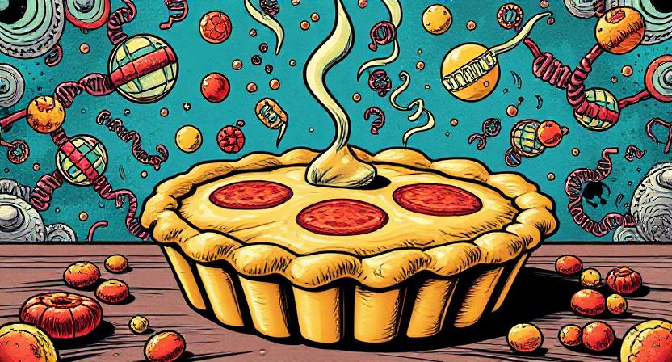
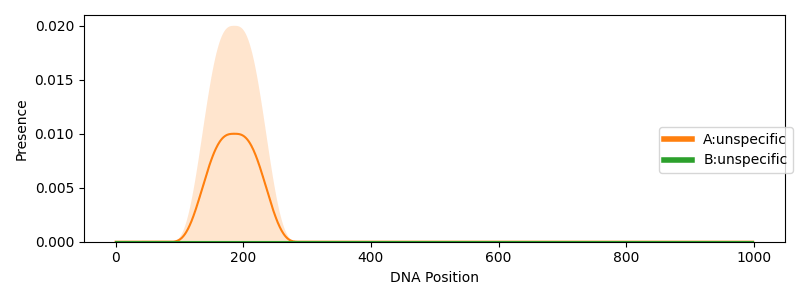

(Banner produced using DeepAI's prompt-to-image creator https://deepai.org/machine-learning-model/pop-art-generator)
# Ruth's Gills Pie: A Rule-Based Gillespie Algorithm for Simulating Particle Interactions With a Polymer in Python

*Ruth's Gills Pie* is a Python framework that simulates and approximates interactions between particles and a polymer based
on user-defined rules. Any process that involves freely diffusing molecules in a well-mixed solution that interact with a 
polymeric structure can be simulated. Interaction rates can be fitted to data that measures superimposed and independent instances.
Ruth's Gills Pie was developed for simulating DNA-protein interactions unfolding in single cells and fitting
parameters to provided Next Generation Sequencing (NGS) data. It addresses in particular the challenge of linking dynamic
processes in single cells with static NGS data, which I have discussed previously [1].

*Ruth's Gills Pie* is currently in preparation for publication but is described in detail in my [PhD thesis](https://theses.hal.science/tel-04721015).
If you find the framework useful for your own research, please consider citing

> Zeitler, L. (2023). Computational and Mathematical Modelling of DNA Repair in Budding Yeast (Doctoral dissertation, Université Paris-Saclay).

or
```
@phdthesis{zeitler2023computational,
  title={Computational and Mathematical Modelling of DNA Repair in Budding Yeast},
  author={Zeitler, Leo},
  year={2023},
  school={Universit{\'e} Paris-Saclay}
}
```

*Ruth's Gills Pie* was developed as part of my PhD thesis at [Julie Soutourina's laboratory](https://www.i2bc.paris-saclay.fr/equipe-genome-transcriptional-regulation/).

The following examples and explainers are centred around DNA-protein interactions and sequencing data. However, keep in mind that
the implementation is general and broadly applicable, even outside a biological context.

## Introduction
The advent of high-throughput NGS technology has enabled the assessment of DNA-related process in unprecedented detail
on a genome-wide scale. However, as we have demonstrated before [1], linking static NGS data to dynamic processes in
a single cell is far from trivial. We argue that new approaches that explicitly model cell-specific processes are needed.

We present *Ruth's Gills Pie*, an easy-to-use and general computational framework to simulate and fit NGS data based on 
the Gillespie algorithm [2] and user-defined interaction rules, i.e. interactions between molecules.
We implemented a fast parameter estimation using a modified version of backpropagation based on a differentiable 
approximation of the reaction probability in a chemical system, which is sometimes referred to as the 
Gillespie update step. To our knowledge, this is the first holistic simulation and training package
for NGS data which can be applied to most molecular pathways.

Rules are defined by a condition, a causal effect, and the frequency of the event within an arbitrary but fixed time step (for example a minute). They commonly consist of 
protein-protein or DNA-protein association/dissociation behaviour, but they can equally contain movements along the DNA.
We extended the traditional Gillespie algorithm to include the notion of space along the DNA as a one-dimensional polymer. 
Proteins as well as specific DNA positions can transition between different states to modulate behaviour. For example,
proteins can become phosphorylated and DNA can be damaged.
Although the library can be used for simulating entire chromosomes, we recommend focusing on smaller compartments to reduce
runtime. In the following, we exemplify Ruth's Gills Pie through DNA-protein interactions.
Yet it can be equally applied to any particle interactions along a one-dimensional polymer
(such as ribosomal interactions with an aminoacid chain), as long as distributional data is available.
          

## Installation
The software requires `python` (`3.6` or higher, tested on `3.9`). Clone the repository and navigate to the directory. 
If `pip` is installed, you can install requirements by running
```commandline
python3 -m pip install -r requirements.txt
```

## General Assumptons
Chemical reactions (i.e. the user-defined rules) are randomly sampled based on the possible number of interactions given 
the current state of the system (e.g. the simulated cell) and the reaction frequency as soon as all conditions for the reaction are met.
Let's consider a reaction between protein *A* and *B*, each of which are present 100 times in a given
volume. There are 100 x 100 = 10000 possible interactions between the proteins of species *A* and *B*.
Furthermore, assume the reaction happens with a frequency of *f*=0.0025. The number of interactions that are expected to be observed
in the system with a given volume within the next time step is therefore 10000 * 0.0025 = 25. Based on this distribution
over all possible reactions, it is possible to sample a reaction and the corresponding time step tau when we expect to observe it.

The Gillespie algorithm along the one-dimensional polymer assumes that there is no global knowledge. Every protein or particle interacts 
independently with the DNA molecule. However, we make several important assumptions and simplifications

- The DNA is in a well-mixed solution. Therefore, we do not need to keep track of every protein that is in the nucleus. Note that this assumption could possibly limit the length of DNA that can be reasonably represented
- As soon as a protein interacts with the DNA, we incorporate the notion of space. Therefore, we randomly sample the position to which the protein binds. The set of possible positions can be restricted by the rules.
- We enforce that only one protein of the same kind (independent of its state) can associate to the same DNA position in a single cell.
- Proteins of different kinds can bind to the same position.

Directed particle movements along the polymer are simulated by stochastic one-dimensional movements in a force field. 
More precisely, we compute the particle displacement within time step tau using the Smoluchowski equation.

The rules can be simulated for several cells in parallel. Aggregating the occupancy profiles results in the NGS data. To
constrain parameter fitting, we presume that particles don't interact independently of the polymer in the well-mixed solution.
The overall reaction mechanism which performs the simulation and training is implemented in the `gillespie.py` module.

## States and interactants
All particles must be defined as interactants, i.e. molecules that can participate in a reaction. That includes
the DNA and any other particle, such as proteins, lipids or snoRNAs etc. Whilst the user is free to define any particle
they like, they are all categorised into: 
- DNA,
- bound interactant, 
- and free interactant. 

Proteins will transition between bound and free, and they change their corresponding group dynamically. The categories
are important for defining the rules with respect to different protein conformations (i.e. bound protein or free protein).
However, it is not expected that the polymer (i.e. the DNA) changes its group. More information about how the categories are
used can be found in *Section Rules*. The implementation of interactants is defined in the `interactants.py` module.
Each interactant is named for the ease of use, but they are internally represented by unique numerical values.

To define your particles, follow this syntax template

```python
from src.interactants import convert_to_dict
proteins = ['protein A', 'protein B']
dna_segments = ['core promoter', 'tss']
protein_states = ['associated', 'phosphorylated']
dna_states = ['damaged', 'repaired']

protein_dict = convert_to_dict(proteins)
dna_dict = convert_to_dict(dna_segments)
protein_state_dict = convert_to_dict(protein_states)
dna_state_dict = convert_to_dict(dna_states)

protein_a_id = protein_dict['protein A']
```

Every dictionary contains also a `default` state (id 0) and an `unspecific` state (id -1). `default` represents all undefined
states, whereas `unspecific` can be used to define a rule over all protein types or states.

Each defined protein, molecule and DNA position can be in different states. It is therefore possible to make the rules
dependent on specific states. For example, elongation of phosphorylated Pol2 is possible but any other Pol2 is not affected.
It also allows transitioning between different states to simulate a particular process. E.g. damaged DNA can transition
to cleaved, removed, replaced, and repaired.


## The Gillespie DNA
Proteins can associate from the well-mixed solution to the DNA or dissociate from it. The implementation makes it possible
to categorise positions to enforce different DNA-protein interactions (e.g. the TSS or the core promoter). 
Each position can be only assigned to one category. They cannot be changed by a rule.
If a change is required, this must be done by specifically overwriting the positions to be part of a new segment. 
All undefined positions are set to `default`. The DNA is implemented
in the `dna.py` module.

The DNA can be created with the following syntax

```python
from src.dna import DNALayout
import torch
dna_size = 1000
# Each segment is defined by the triple (start position, end position, type)
cp_start = 100
cp_end = 300
tss_start = 300
tss_end = 400
device = torch.device('cpu')  # Tensor flow device
dna_specs = [
        (cp_start, cp_end, dna_dict['core promoter']),
        (tss_start, tss_end, dna_dict['tss'])
]
dna = DNALayout(dna_size, dna_specs, device=device)
```

The Gillespie *DNA* implements the same algorithm as described in [1], but it includes the notion of space. Thus, next to the type of
reaction and the reaction time, we sample also a position to and from which a protein is associating/dissociating. 
The set of possible positions can be restricted by the defined rules to a particular class of positions. 


## Rules
Rules define a condition with via a set of reactants (with their respective states) and the corresponding products (with their respective states) together with the reaction 
frequency. Additionally, it is possible to define a directed movement along the DNA, either to the left or the right.
As rules can be made dependent on several segments, it is possible to limit movement. For example, the elongation of
Pol2 can be restricted to TSS, transcript, and TES.

Rules are implemented in the following syntax

```python
from src.rules import DNA_REACTANT, SPECIES_REACTANT, DNA_SPECIES_REACTANT, DEFAULT, UNSPECIFIC, rule_set_factory
# create a rule set
rule_set, = rule_set_factory(
    protein_dict,
    dna_dict,
    protein_state_dict,
    dna_state_dict,
    n_rule_set=1,   # Number of rule sets to be created. Normally 1, but if a change between rule sets 
                    # is required during simulation, several can be instantiated simultaneously
    dna=dna,  # the DNA instance
    device=device  # Tensorflow device. Either cpu or a specified gpu
)

# Rules are defined by the following pseudo-formal logic notation
# (present reactants) AND (absent reactants) -> (products)
# Each participating interactant (reactant and product) is defined by the triplet (name, state, type),
# where name the name of the molecule (e.g. protein A or tss), state is the state of the molecule (e.g. default or 
# phosphorylated), and type is the type of particle (i.e. DNA reactant (DNA_REACTANT), 
# bound protein (DNA_SPECIES_REACTANT), or free protein (DNA_REACTANT))
# Note that rules are not defined by the molecule ids but by their names. 
# The value UNSPECIFIC is passed when a rule can be applied to any value of a kind. For example, if the rule is
# unspecific with respect to the state of protein A, it can be applied to any of them. Similarly, this can
# be applied for entire particle types (e.g. a rule can be applied to protein A and B). Note that if the
# product is also defined to be unspecific, it is set to the value of the sampled reactant. If a rule can be applied
# to several state but not to all, they can be defined in brackets within the species definition, e.g. ('protein A', ['associated, 'phosphorylated'], DNA_SPECIES_REACTANT).

# Each outer bracket defines a DNA region where these rules apply. You can therefore define a rule for chromatin
# changes at different DNA positions at the same time. All DNA regions must occur in reactants and products, otherwise
# an error is raised.

# IMPORTANT: the DEFAULT state for the type DNA_SPECIES_REACTANT represents a free position on the DNA. All 
# association rules should be defined by requiring the presence of a free position for a given particle.

# This rule defines the association of protein A in an phosphorylated state to the core promoter if protein B is present at the TSS in an
# phosphorylated state and no other protein A is already present at the core promoter.
rule_set.add_rule(
    # Reactants that must be present for a reaction to occur
    reactants_presence=[
     # Required state at the core promoter
     [
        ('core promoter', DEFAULT, DNA_REACTANT),
        ('protein A', UNSPECIFIC, SPECIES_REACTANT),
        ('protein A', DEFAULT, DNA_SPECIES_REACTANT),
    ],
    # Required state at the TSS
    [
        ('tss', DEFAULT, DNA_REACTANT),
        ('protein B', 'phosphorylated', DNA_SPECIES_REACTANT)
    ]
    ],
    # Only association when protein A is not already present
    reactants_absence=[[
        ('core promoter', DEFAULT, DNA_REACTANT),
        ('protein A', ['associated', 'phosphorylated'], DNA_SPECIES_REACTANT)
    ]],
    products=[
     # Define the product state at the core promoter
     [
        ('core promoter' , DEFAULT, DNA_REACTANT),
        ('protein A', 'phosphorylated', DNA_SPECIES_REACTANT)
     ],
     # Define product state at the tss. This is crucial to be defined, even though there is no change
     [
        ('tss', DEFAULT, DNA_REACTANT),
        ('protein B', 'phosphorylated', DNA_SPECIES_REACTANT)
     ]
     
    ],
    c=0.1,
    force=0  # Optional
)
```

## Simulation
With all the prior definitions, it is now possible to simulate NGS data with the parameters provided in the rules.
A GillesPy object can be easily instantiated and executed via
```python
from src.interactants import UNSPECIFIC, InteractantList, DNASpeciesReactant, DNAReactant, DNA_SPECIES_REACTANT, DNA_REACTANT
from src.gillespie import Gillespy
import torch
n_proteins = {'protein A': 200, 'protein B': 100}  # Number proteins available in well-mixed solution
D = 100  # Amount of noise assumed in update positions for particle movements
n_cells = 30  # Number of simulated cells
# Uncertainty about the exact particle position. This window sets all protein states along the DNA within the window
# to the most occurring state. This can be also understood as representing several similar cells at the same time
uncertainty = 20  
smoothing = 100  # Smoothing of the simulated NGS which aims to represent the sonication step
# Define the probed sequencing signal as an output
probing = [('protein A', UNSPECIFIC, DNA_SPECIES_REACTANT), ('protein B', 'phosphorylated', DNA_SPECIES_REACTANT)]
sequencing_colors = ['tab:blue', 'tab:green']  # Define sequencing colors
sampling_time = 30  # Sampling time in a fixed time unit (normally minutes)
# Number of cells that are updated in a time step. It's recommended to set this value lower than 1 to avoid
# oscillations due to synchronicity
n_samples = int(.3 * sum(n_proteins.values())) 
verbosity = 3  # set verbosity level
proteins = torch.zeros(rule_set.n_species)
# Define number of free available proteins in the well-mixed solution around the DNA
for prot_name, value in n_proteins:
     proteins[protein_dict[prot_name]] = value
gillespy_simulator = Gillespy(
      data=data,  # Can be None for simulations, but are required if you use a dna init callback function
      rules=rule_set,
      D=D,
      proteins=proteins,
      n_cells=n_cells,
      dna=dna,
      uncertainty=uncertainty,
      seq_bias=smoothing,
      device=device
  )

inter_list = []
inter_names = []
for probe in probing:
    if probe[-1] == DNA_SPECIES_REACTANT:
        inter_names.append('%s:%s' % (probe[0], probe[1]))
        probe_type = DNASpeciesReactant
        react = protein_dict[probe[0]]
        state = protein_state_dict[probe[1]]
        n_reactant = len(protein_dict) - 1 # Reduce by unspecific
        n_state = len(protein_state_dict) - 1 # Reduce by unspecific
    elif probe[-1] == DNA_REACTANT:
        inter_names.append('dna:%s' % probe[1])
        probe_type = DNAReactant
        react = dna_dict[UNSPECIFIC]  # Cannot sequence position specific, ie. only core promoter
        state = dna_state_dict[probe[1]]
        n_reactant = len(dna_dict) - 1,  # Reduce by unspecific
        n_state = len(dna_state_dict) - 1  # Reduce by unspecific
    else:
        continue
    inter_list.append(probe_type(
        reactant=react,
        state=state,
        n_reactant=n_reactant,
        n_state=n_state
    ))
    
seq_probing = InteractantList(inter_list=inter_list)
gillespy_simulator.run(
    sampling_time,
    probing=seq_probing,
    labels=inter_names,
    n_samples=n_samples,
    dna_init_callback=None,  # Callable for initial DNA chromatin state. When none, simulation starts from a free polymer
    dna_init_data_idc=None,  # The data indices that are used by the dna init callback
    colors=sequencing_colors,
    verbosity=verbosity,
    save_simulation_result=False,  # Save resulting NGS distribution to a csv
    save_fig=False,  # Save NGS simulation as a animated gif
    save_prefix='',  # Prefix that is added to saved data files as identifier 
    plot_frequency= .1  # Simulated time difference when plots are updated
)
```
## Training
Training can be performed using a modified backpropagation algorithm. It takes distributional data for each
particle species from several time points and finds parameter that can recreate the data. Error weights can 
be set species-specific.
It is highly important to note that the training behaviour is slighty different to standard machine learning best practices.
Firstly, note that each parameter (i.e. the reaction frequency and the velocity with which a particle moves) is 
constrained by the user-defined pathway. This provides interpretability, but keep in mind that they aren't free parameters. 
Moreover, learning rates and parameters can differ over several orders of magnitudes.
This is due to the stronly changing numbers of possible interactions when considering association *to* the polymer versus reactions
*on* or dissociation *from* the polymer. We highly recommend
to define reasonable upper and lower bounds for each parameter to avoid exploding values and gradients. Since the forward
simulation is based on stochastic sampling, the algorithm evaluates several possible temporal reaction sequences(exploration),
whilst limiting the search space within which the solution should converge (exploitation with gradient descent). 
Momentum and weights can drag parameters quickly down, and we recommend setting them not too high if at all. 

The training allows the definition of protein and DNA callbacks. These are functions which define the initial state
from which onwards the simulation and training should begin after each training iteration. If not defined, the training
will start from an empty DNA polymer. 

Before running the training, it is highly important to normalise the data appropriately. The parameters in the user-defined
interaction pathway (implemented by the rules) can be approximated by using the provided training function, similar
to the example below:

```python
tp = torch.tensor([15., 25.])  # sequencing time points
# pass one learning rate per rule or one learning rate for all. When set to 0, the parameter is not trained
lr = torch.tensor([.01, 0., 1e-6, 10.])   
# force specific learning rate. Set one per rule or one lr for all. Note that this value must be commonly very large
lr_force = 1e10  
# Set momentum, recommended to be set not too large
momentum = .5
# Set weight decay. Caution should be used, as some implemented pathways are highly sensitive to small values 
decay = 0.
# Number of training iterations
n_epoch = 500 
# Error tolerance when the alogrithm is assumed to have converged. Note that the error is computed over the entire
# DNA, but your rule definitions might not allow protein interactions everywhere. It is unlikely that the error
# becomes very small
tol = 1e-3
# Define parameter specific lower and upper bounds. Also possible to set a single value for all rule
lower_bounds = torch.tensor([1e-3, 1e-2, 1e-6, 1.])
upper_bounds = torch.tensor([1e-1, 1e-2, 1e-4, 50.])
# Upper and lower bounds for force values. Can be defined with a single value for all rules or rule-specific
min_force = 50
max_force = 1000
# Define error weights
error_weight = torch.tensor([10., 1.])
# Update all parameters by (sampling boost * parameter value) when not sufficiently many reactions have been sampled.
sampling_boost = .1
# Apply momentum to simulated trained sequencing data 
seq_momentum = 0.

gillespy_estimator.train(
      probing=seq_probing,
      seq_tp=tp,
      lr=lr,
      lr_force=lr_force,
      decay=decay,
      grad_momentum=momentum,
      n_samples=n_samples,
      max_iter=n_epoch,
      tol=tol,
      use_parameter_stop=False,  # If set, the error tolerance break criterion is applied to the parameter updates
      lower_bound=lower_bounds,
      upper_bound=upper_bounds,
      min_force=min_force,
      max_force=max_force,
      error_weight=error_weight,
      sampling_boost=sampling_boost,
      dna_init_callback=None,  # Callable for initial DNA chromatin state. When none, simulation starts from a free polymer
      dna_init_data_idc=None,  # The data indices that are used by the dna init callback
      colors=sequencing_colors,
      save_fig=False,
      save_prefix='',
      save_params=False,  # Save parameters to csv
      save_error=False,  # Save loss to csv
      seq_momentum=seq_momentum,
      verbosity=verbosity,
  )
```

## Use the Boilerplate
To simplify usage, we allow the dynamic loading of rules during runtime. The framework
automatically converts everything to the internal syntax. Although the library can be imported into customised scripts
to allow maximal flexibility and behaviour, we highly recommend the usage of dynamic loading using our boilerplates. 
Provide a template in `examples/trainingFileTemplate.py` and many
other examples in the same folder. In a nutshell, all training or simulation files must contain:

- a `get_parameters` function that returns all necessary parameters in a dictionary
- a `get_data` function which returns the necessary distributional data per time point and particle type. Note that this can be left empty for simulations
- a `get_rules` function that returns the rule definitions, the dna, and all interactants.

These files can be automatically loaded by the `gTraining.py` or the `gSimulation.py` script by providing the 
corresponding path. For example, you can start a simulation
whose parameters are defined in the file `simulation/yourDefs.py` by
```commandline
python3.8 gSimulation.py --simulation_file=simulation/yourPathway.py
```
or similarly for the training
```commandline
python3.8 gTraining.py --training_file=simulation/yourPathway.py
```

Run
```commandline
python3.8 gSimulation.py --help
```
or
```commandline
python3.8 gTraining.py --help
```
for more information about all command line parameters. Other parameters that are required by your own scripts (e.g. the
`simulation/yourPathway.py` file) can be passed as additional CLI parameters using the same naming. For example if
the `get_data` function in the `simulation/yourPathway.py` requires an additional parameter `data_path`, then you can
pass it to the CLI with the following syntax

```commandline
python3.8 gTraining.py --training_file=simulation/yourPathway.py --data_path="my/data/path"
```

Unknown parameters are always parsed to string, and you need to convert the parameter accordinly.
See our examples for more information.

## Examples
The first animation shows the training for a moving particle on the polymer. The molecule can only associate to a small
stretch to the left, needs to move into the polymer, and is dissociated on the right side. We estimate
two successive time points (dashed lines) to obtain equilibrium dynamics as closely as possible. 


In the following, we show the simulation of a rather complicated pathway with feedback loop. Particle *A* associates to the
left side of the polymer. This allows association of particle *B* next to it. This triggers the unloading of *A*.
*B* can then move into the polymer and dissociate from the right side.



In the last example, we aim to fit parameters to the simulation above. We start from an initialisation that makes it impossible
for *B* to associate. The algorithm grapples with different parameter settings before finding a sensible fit. Note that the algorithm transitions through two phases. Firstly, it approximates the distribution of
particle *A* that can associate directly to the polymer. Then it fits the the distribution of *B*, which requires
first increasing the error before finding a better parameter fit.


## References
[1] Zeitler, L., Goldar, A., Denby Wilkes, C., & Soutourina, J. (2024).
The next-generation sequencing—chess problem. NAR Genomics and Bioinformatics, 6(4), lqae144.

[2] Gillespie, Daniel T.
 "Exact stochastic simulation of coupled chemical reactions." 
 The journal of physical chemistry 81.25 (1977): 2340-2361.  

